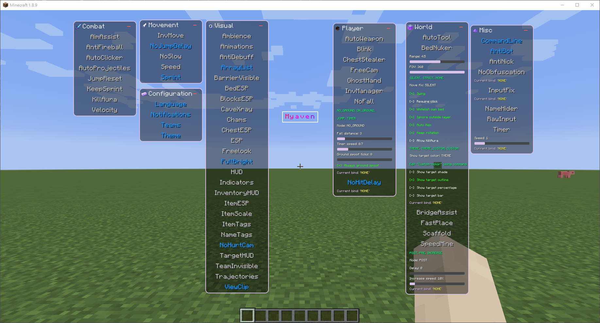

> [!WARNING]
> Remapping is still work in progress and not ready for use

# Open Ryaven (Myaven)

Ryaven (Formerly called **Myaven**) is a dogshit minecraft forge cheat made by [NHCM](https://www.youtube.com/@NHCMhappyforever).

Almost everything was pasted from other leaked client src, and this client is sold for $17 I don't know who the hell would think this is worth it.

## Progress

It would be stupid to cost $17 just to deobfuscate/crack this shit so that native methods can't be debugged and restored dynamically.

I plan to rewrite all native methods manually.

- [x] Basic deobfuscation (string, number, 50% renamer, etc)
- [x] Rework client injecting logic, make client runnable in IDE
- [ ] Fix features
- [ ] Rework commands
- [ ] Rework pasring config
- [ ] Rework saving config
- [ ] Code cleanup

Commands and some systems are protected by native and need to be restored manually (their native will not be loaded before passing auth and protected by Themida so I can't really denative without purchasing).

If you are interested in restoring them, please contact me on Discord: `60124808866_88040`.

